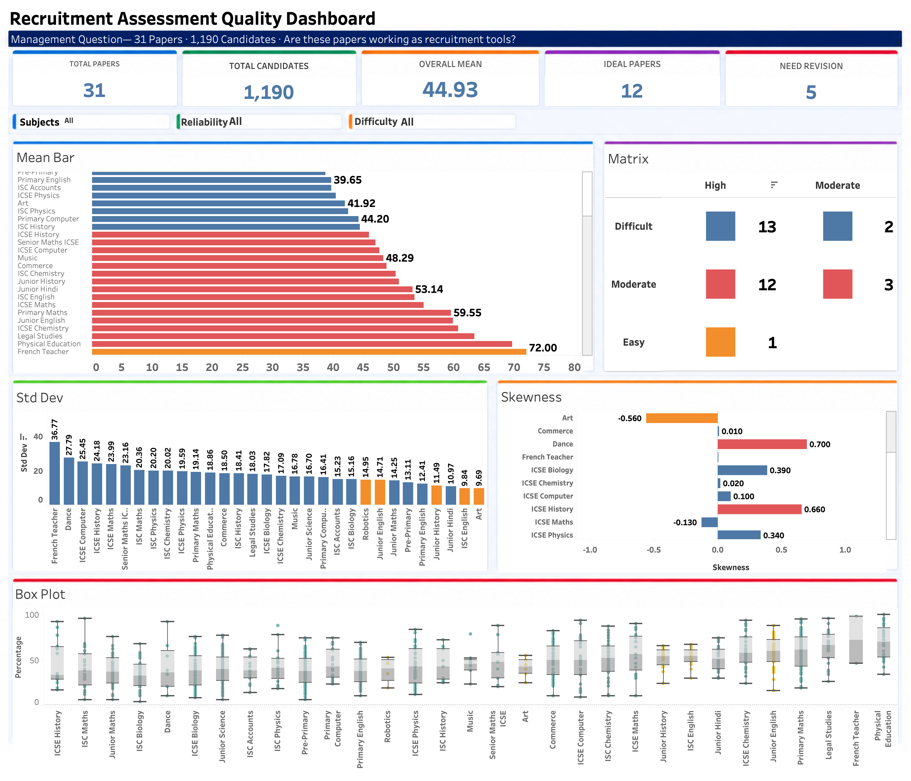

# Recruitment Assessment Quality Analysis

## Project Overview

This project analyses **31 recruitment test papers** administered to **1,190 candidates** across various grade-subject combinations.

**Core Question:**
> *Are these internally developed recruitment tests reliable and effective tools for hiring teachers across different grade-subject levels?*

---

## Tools Used

| Tool | Purpose |
|---|---|
| Python (Pandas, NumPy, Matplotlib, Seaborn) | Data cleaning, EDA, visualisation |
| SQL | Analytical queries replicating the Python analysis |
| Tableau | Interactive dashboard |

---

## Repository Structure

```
recruitment-assessment-analysis/
│
├── README.md                          ← This file
├── Recruitment_Assessment_Analysis.ipynb   ← Main Python notebook
├── Recruitment_Assessment_SQL.sql          ← SQL version of analysis
├── Master_Data.csv                         ← Raw data (candidate names removed)
├── assessment_summary.csv                  ← Paper-level summary for dashboard
├── candidate_data.csv                      ← Cleaned candidate data with percentages
└── Dashboard.png                           ← Final dashboard screenshot
```

---

## Methodology

Each paper was evaluated on **two dimensions:**

### 1. Difficulty
Based on mean percentage score of candidates:

| Mean Score | Label |
|---|---|
| 70% and above | Easy |
| 45% – 69% | Moderate |
| Below 45% | Difficult |

### 2. Reliability
How well the paper differentiates between candidates — measured using three indicators:

| Metric | What it measures |
|---|---|
| Standard Deviation | Overall spread of scores |
| IQR | Spread of the middle 50% of candidates |
| Skewness | Whether scores are balanced or heavily skewed |

Each indicator is scored (0, 1, or 2) and combined into a composite score:
- **High Reliability** — composite ≥ 4
- **Moderate Reliability** — composite 2–3
- **Low Reliability** — composite < 2

---

## Key Findings

- **31 papers** evaluated | **1,190 candidates** | **Overall mean: 44.93%**
- **15 papers** are Difficult (mean below 45%)
- **15 papers** are Moderate difficulty
- **1 paper** is Easy
- **26 out of 31 papers (84%)** show High Reliability
- **12 Ideal papers** — Moderate difficulty + High Reliability
- **5 papers need revision** — limited ability to differentiate candidates
- **0 papers** have Low Reliability — no paper is completely failing

### Papers Needing Revision
Art, ISC English, Junior English, Junior History, Robotics

### Notable Insight — Mean vs Median
ICSE History shows the largest Mean–Median gap (13.94 points):
Mean = 45.94% but Median = 32% — a few high scorers inflate the average,
making the paper appear Moderate when most candidates actually found it Difficult.

---

## Dashboard Preview



---

## Data Privacy Note
Candidate names have been removed from the dataset before publishing.
The analysis uses only marks obtained and maximum marks per paper.

---

## Author
**Divyanshi**
Data Analyst
